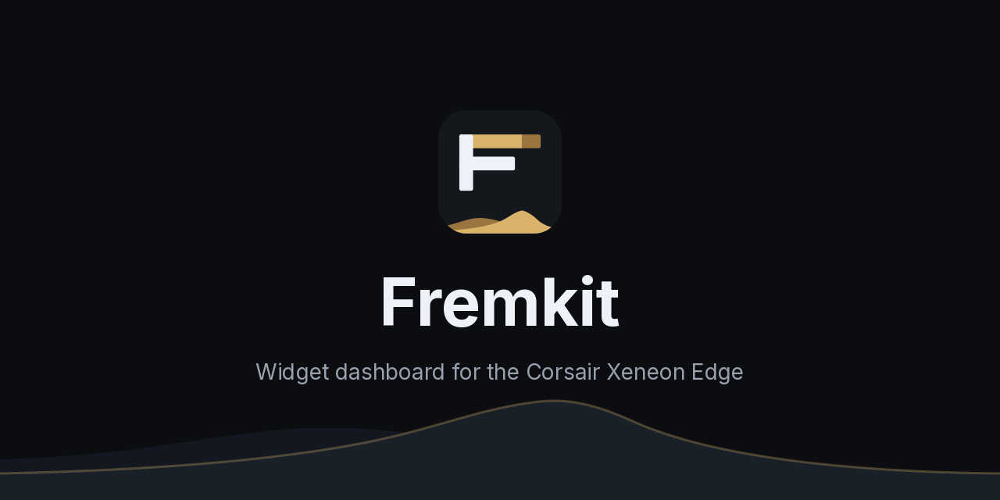
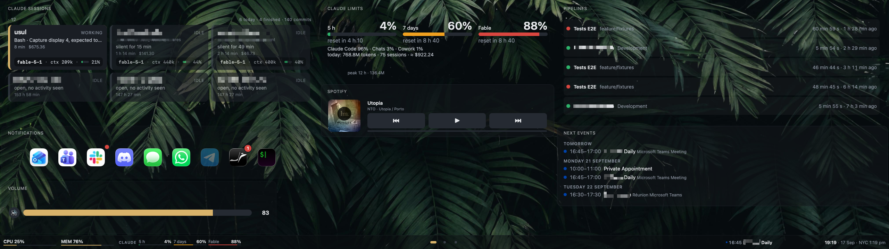
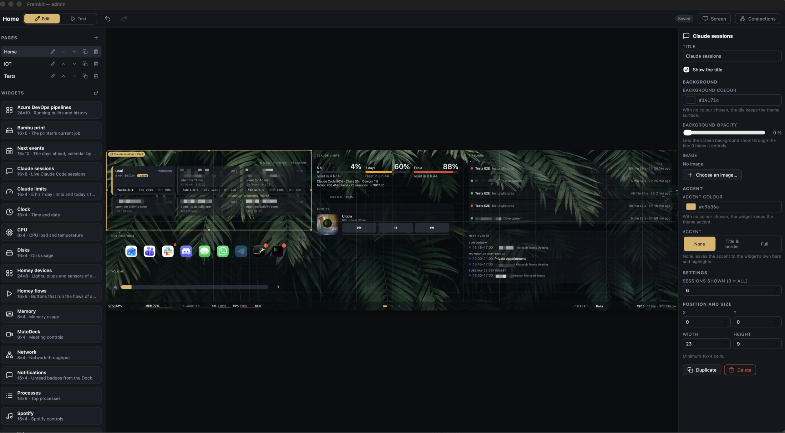
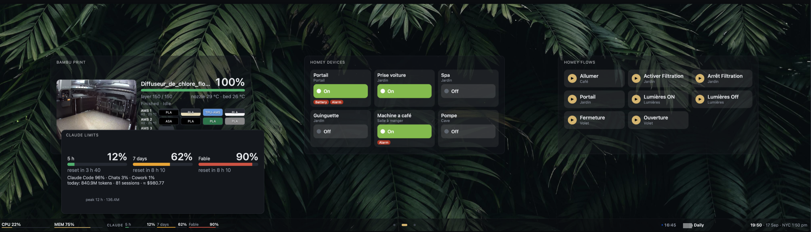
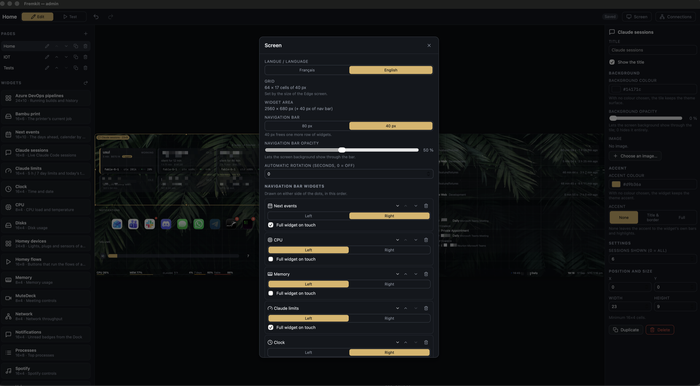
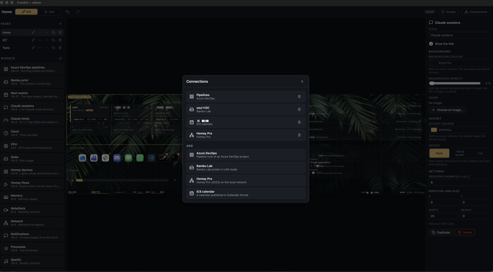

<p align="center"></p>

# Fremkit

Fremkit turns the Corsair Xeneon Edge — a 2560 × 720 touch strip — into a widget dashboard for
your Mac. Pages of tiles show the clock, the machine's load, your calendar, your build pipelines,
your 3D printer, your smart home; you arrange them by dragging them around in a browser-based
admin, and you drive them by touch through a native macOS helper. Widgets are plain HTML folders,
so writing one takes a manifest and an `index.html` — no build step, no framework.





The name is the Fremen survival kit from *Dune*.

## Features

- **Pages** of tiles on a 64 × 16 grid, switched from a navigation bar, with optional
  auto-rotation.
- **A live editor** at `/admin`: the real page rendered with real widgets, drag and resize with
  snapping, overlap refused, keyboard nudges, undo/redo and autosave.
- **Twenty-six widgets** out of the box — clock, weather, a pomodoro timer, CPU, memory, disks,
  network throughput, batteries, processes, volume, Spotify, meeting controls,
  Dock badges, a clipboard history, shortcut buttons, CleanShot X actions, service status checks,
  Claude Code sessions and limits, Azure DevOps builds, GitHub notifications and Actions, a Bambu
  Lab printer, published calendars, Homey devices and flows.
- **Compact widgets** in the navigation bar, with a full-size popover on touch.
- **Per-tile appearance** — background colour, opacity, background image, accent colour and how
  much of the tile the accent paints.
- **Connections** — named credential sets for outside services, with secrets kept in the macOS
  keychain rather than in the config file.
- **A native helper** — a menu bar app that drives the Edge's touch panel with its own HID
  driver, fences the mouse out of the display, shows the dashboard in a kiosk window and
  supervises the server.
- **Two languages** — the whole interface is French or English, switched in the admin.
- **A widget SDK** that is a folder, a JSON file and an HTML page.

## Requirements

- macOS 13 or later, Apple silicon
- Xcode Command Line Tools (for the helper's Swift build)
- Node 22 or later, and pnpm
- a Corsair Xeneon Edge — everything except the touch driver works on any display
- `jq`, only for the Claude Code status line
- `ffmpeg`, only for the chamber camera of an X1 or H2 printer

## Install

1. **Clone and set up.**

   ```sh
   git clone https://github.com/fdussert/fremkit.git
   cd fremkit
   pnpm setup
   ```

   `pnpm setup` checks the prerequisites, installs dependencies, builds the UI and the server,
   offers to create the code-signing identity, then builds and installs the helper into
   `~/Applications` and points it at your checkout. `pnpm setup --check` runs the checks only.

2. **Say yes to the signing identity** when it asks. The helper is signed ad hoc unless a stable
   code-signing identity exists, and macOS ties Input Monitoring and Accessibility grants to the
   signature — so with an ad-hoc signature every rebuild would drop the permissions you just
   granted. `scripts/create-signing-identity.sh` creates a local self-signed "Fremkit Helper Dev"
   certificate in your login keychain. It asks for your login password and is idempotent.

3. **Quit Touchscreen Gestures**, if you use it. It holds the touch controller exclusively, so the
   helper's driver cannot open the panel while it runs — the helper replaces it, it does not
   coexist with it. Quitting the app is not enough while its launchd agent relaunches it:

   ```sh
   launchctl bootout "gui/$UID" ~/Library/LaunchAgents/<its agent>.plist
   ```

4. **Grant Input Monitoring.** System Settings → Privacy & Security → Input Monitoring → add
   "Fremkit Helper". Required to read the touch panel's raw HID reports.

5. **Grant Accessibility.** Same place → Accessibility → add "Fremkit Helper". Required to post
   the synthetic mouse and scroll events the touch driver generates, and to read the Dock's
   badges.

6. **Relaunch the helper** — quit it from the menu bar **F**, then open it again from
   `~/Applications`. Grants only take effect on the next launch.

7. **Allow Local Network** when macOS asks. It asks the first time the server reaches a device on
   your LAN — a Bambu printer, a Homey. The app to allow is "Fremkit Helper".

8. **Launch at login**, optionally, from the menu bar menu. There is no `KeepAlive`: if the helper
   crashes, open it again by hand.

Rebuilding the helper later (`pnpm helper:build && pnpm helper:install`) is what registers changes
to its bundle, including the `fremkit://` URL scheme the dashboard's long press uses to open the
admin window: an older copy ignores it.

The dashboard then opens by itself on the Edge. If you would rather not run the helper at all,
`pnpm start` serves everything and `pnpm kiosk` opens a full-screen Chrome window on the Edge —
you lose the touch driver, the mouse fence and the Dock badges.

## First run

1. **Open the admin** — from the menu bar **F** menu, or at <http://127.0.0.1:4242/admin>.
2. **Add a page** with the **+** in the Pages list, and name it.
3. **Add widgets** — click a card in the widget library to drop it in the first free spot, or drag
   it onto the canvas. Drag it to move it, pull a handle to resize it.
4. **Set it up** — with a widget selected, the right column shows its title, appearance and its
   own settings. A widget that needs a service asks for a connection; create one with
   **Connections** in the top bar.
5. **Switch to Test** to use the widgets for real. Everything saves on its own; the chip in the
   top bar says saved, saving or not saved.

### Editing, in more detail

The admin's middle column is the real page, rendered with live widgets and scaled to fit, with the
navigation bar below it exactly as the Edge shows it.

- **Edit / Test** — in Edit, an overlay captures the mouse: click to select, drag to move, eight
  handles to resize. In Test the overlay steps aside and the widgets are usable, and the preview
  behaves like the screen: a horizontal swipe on the navigation bar or on free board space changes
  page, wrapping around at either end.
- **Keyboard** — arrows move the selection by one cell, Shift+arrows resize it from the south-east corner, Delete or Backspace removes it,
  Cmd+D duplicates it, Escape deselects. Cmd+Z and Cmd+Shift+Z undo and redo anywhere, up to 50
  steps.
- **Left column** — the pages (rename, reorder, duplicate, delete) and the widget library, with a
  rescan button that re-reads the `widgets/` folder without restarting the server.
- **Right column** — *Widget*: title, whether the frame draws it, background, accent, the widget's
  own settings, position and size. *Page*: name and order. *Screen*: language, grid (read-only),
  navigation bar height and opacity, auto-rotation delay, the bar's compact widgets, the screen
  background, and the kiosk URL.
- **Move to page** — a tile can be sent to another page from the *Widget* tab: it keeps everything
  it carries and lands in the largest free spot there, or the move is refused when nothing fits.
- **Copy settings from…** — where the same widget already exists elsewhere, a drop-down above its
  settings copies the configuration of another of its instances, tile or navigation bar, in one step.
- **Saving** — every change saves on its own, grouped over 300 ms, as a `PUT /api/config` of the
  whole configuration. A refusal shows the message in a toast and reloads from the server. Two
  admin tabs open at once are last-writer-wins.

## Concepts

**Pages.** A dashboard is any number of pages, each a full screen of tiles. You switch between
them by swiping, by tapping the dots in the navigation bar, or automatically after a delay you
set (*auto-rotation*, off by default).

**The grid.** A page is 64 columns by 16 rows of 40 px cells — the Edge's 2560 × 720, less the
navigation bar. A 40 px bar leaves 17 rows instead of 16. Every position and size is in whole
cells: placement snaps to them, and a drop that would leave the screen or overlap a neighbour is
refused with a red ghost rather than silently adjusted.

**Tiles and sizes.** A tile is one instance of a widget, with its own settings, position and size.
Each widget declares a minimum size the editor will not go below and a default size it is dropped
at; between the two the size is free, and a well-written widget reflows.

**Appearance.** Every tile carries its own look: a background colour, an *opacity* from 0 to 1
that lets the screen background show through (0 makes the tile, border included, fully
see-through — the selection outline keeps it findable while editing), a background image with a
dimming overlay, an accent colour, and an *accent mode* saying how much of the tile that accent
paints: **none** leaves it to the widget's own highlights, **frame** colours the title bar and the
border, **fill** colours the whole tile. The screen itself has a background colour and image too.

**The navigation bar.** The strip at the bottom of every page, 80 px or 40 px tall, as opaque as
you like. Its middle is the page dots. Its two sides are free. Hold the page dots for a second and
a half to open the admin.

**Compact widgets.** Widgets can live *in* the bar, in a left or a right cluster, in the order
you set, as many as fit beside the page dots. A compact rendering is one readable line, as wide
as the widget's manifest asks for and as tall as the bar; the bar is its surface, so it has no
title and no tile of its own. Twelve widgets ship with one: `clock`, `weather`, `pomodoro`,
`cpu`, `memory`, `network`, `battery`, `calendar`, `claude-usage`, `github-inbox`,
`homey-devices` and `service-status`.

**Full widget on touch.** A bar widget can be marked for a popover: touching it opens the same
widget at its full default size above the bar. It closes on a second touch, on a touch outside it,
on a page change, or after fifteen seconds.





**Connections.** A widget that talks to an outside service — Azure DevOps, GitHub, a Bambu
printer, a Homey, a published calendar — reads its credentials from a named *connection*, configured once in
the admin and referenced by the widget. Several widgets can share one, and one service can have
several. Non-secret fields live in `data/fremkit.json`; secrets go to the macOS **keychain**
(or, with the `file` backend, to a mode-600 `data/secrets.json`) and are never returned by the
API, logged, written to the config or sent on the WebSocket.

**Language.** French or English, switched in the admin's Screen panel. It changes the interface,
the widget library and the widgets themselves, live, without a reload.

**The helper, or a browser.** The dashboard is a web page: any browser can show it. The native
helper adds what a browser cannot — its own HID driver for the Edge's touch panel, a fence that
keeps the mouse cursor on your other displays, a kiosk window with no chrome and no cursor, the
Dock's notification badges, and supervision of the server. Its menu bar **F** shows what is
running: *Open the admin*, *Admin in the browser*, *Reload the dashboard*, the *Touch* / *Mouse
fence* / *Notifications* / *Manage the server* / *Launch at login* toggles, *Log…* and *Quit*,
above state lines such as "Server: running" and "Touch: active".

## Widgets

| Widget | Shows | Connection | Compact |
|---|---|---|---|
| `ado-pipelines` | Azure DevOps runs in progress and recent history | Azure DevOps | — |
| `bambu-job` | A printer's current job, AMS and chamber camera | Bambu Lab | — |
| `battery` | The Mac's battery and its Bluetooth peripherals | — | ● |
| `calendar` | The next events of one or more published calendars | ICS calendar | ● |
| `claude-sessions` | Live Claude Code sessions | — | — |
| `claude-usage` | Claude 5 h / 7 day limits and today's tokens | — | ● |
| `cleanshot` | Big touch buttons for captures, needs [CleanShot X](https://cleanshot.com) with its URL scheme API allowed | — | — |
| `clipboard` | Recent clipboard entries, tap to copy back | — | — |
| `clock` | Time, date and other cities | — | ● |
| `cpu` | CPU load and temperature | — | ● |
| `disk` | Disk usage | — | — |
| `github-actions` | Running and finished GitHub Actions workflows | GitHub | — |
| `github-inbox` | GitHub notifications, review requests and pull requests | GitHub | ● |
| `homey-devices` | Lights, plugs and sensors of a Homey Pro | Homey Pro | ● |
| `homey-flows` | Buttons that run a Homey Pro's flows | Homey Pro | — |
| `memory` | Memory usage | — | ● |
| `mutedeck` | Meeting controls through MuteDeck | — | — |
| `network` | Live network throughput, with a sparkline | — | ● |
| `notifications` | Unread badges read from the Dock | — | — |
| `pomodoro` | A work and break timer, driven by touch | — | ● |
| `processes` | Top processes | — | — |
| `service-status` | A green, amber or red dot per service it pings | — | ● |
| `shortcuts` | Big touch buttons that open apps, links and shortcuts | — | — |
| `spotify` | Current track and transport | — | — |
| `volume` | System volume | — | — |
| `weather` | Current weather and forecast, from Open-Meteo | — | ● |

Every setting of every widget is listed in **[docs/widgets.md](docs/widgets.md)**. To write your
own, see **[docs/writing-widgets.md](docs/writing-widgets.md)**.

## Connections

| Type | Needs | Used by |
|---|---|---|
| Azure DevOps | organisation, project, a personal access token with Build (read) | `ado-pipelines` |
| Bambu Lab | IP address, serial number, LAN access code | `bambu-job` |
| GitHub | a personal access token — classic for the notifications, fine-grained enough for reviews, pull requests and Actions — optionally an Enterprise API host | `github-inbox`, `github-actions` |
| Homey Pro | the Homey's address, an API key with Devices and Flows in read and control | `homey-devices`, `homey-flows` |
| ICS calendar | the published calendar address, a colour | `calendar` |


How to obtain each credential, what is stored where, and what is never logged:
**[docs/connections.md](docs/connections.md)**.

## Backup

**/admin → Screen → Backup** downloads the whole dashboard — the config and the background
library — as a zip, and restores one. Secrets are never in it: they stay in the macOS keychain.
Details in **[docs/contributing.md](docs/contributing.md)**.

## What Fremkit reads on your Mac

Fremkit is a dashboard of your own machine, so several widgets read things that belong to you.
The list is short and it is all of it.

| What | Who reads it | When |
|---|---|---|
| `~/.claude/projects/` — Claude Code's session transcripts | the `claude-sessions` and `claude-usage` widgets, for the session list and the token counts | whenever one of those widgets is on the dashboard |
| The `Claude Code-credentials` keychain item — Claude Code's OAuth token | the account usage behind the `claude-usage` gauges. The token is presented to `api.anthropic.com` and nowhere else; it is never stored, never logged, never in an error message | **off for a new install.** Turn it on in **/admin → Screen → Privacy**. A dashboard that already showed the Claude widget before this setting existed keeps it *on*, so the gauges do not go blank on an upgrade — turn it off there if you would rather. The endpoint (`/api/oauth/usage`) is not documented by Anthropic and may disappear |
| The clipboard, through `pbpaste` | the `clipboard` widget | whenever that widget is on the dashboard |
| The Dock's badge counts and the icons of installed applications | the `notifications` and `shortcuts` widgets, through the helper | whenever one of those widgets is on the dashboard |
| The volume, the battery, the disks, the processes, the network | those widgets, through `pmset`, `df`, `ps` and friends | whenever one of them is on the dashboard |

Everything else Fremkit knows, you typed into it: the connections of the table above, whose
secrets live in the macOS keychain (see [docs/connections.md](docs/connections.md)). Nothing is
sent to any server other than the ones you configured, there is no telemetry, and the server
listens on `127.0.0.1` only.

## Troubleshooting

| Symptom | Fix |
|---|---|
| "Touch: permission missing" | Grant Input Monitoring to "Fremkit Helper", then relaunch it |
| "Touch: taken by another driver" | Quit Touchscreen Gestures and unload its launchd agent |
| Permissions reset after every rebuild | Run `scripts/create-signing-identity.sh` and rebuild |
| A LAN device answers `ping` but not Fremkit | Allow Local Network for the app running the server |
| "Server: external" | Something else answers port 4242 — expected under `pnpm dev` |

The rest, with the reasoning: **[docs/troubleshooting.md](docs/troubleshooting.md)**.

## Development

```sh
pnpm dev          # server on 4242 + Vite on 5173 (dashboard http://localhost:5173, admin /admin)
pnpm build        # ui + server
pnpm start        # production: http://127.0.0.1:4242 and /admin
pnpm test         # vitest, server + ui
pnpm typecheck
pnpm helper:build   # native/dist/Fremkit Helper.app
pnpm helper:install
pnpm helper:test
```

| Folder | What is in it |
|---|---|
| `server/` | Fastify 5 on 127.0.0.1:4242 — config, widget catalog, providers, connections, secrets, the bridge, the WebSocket |
| `ui/` | Vue 3 — the dashboard, the admin, and the code they share |
| `native/` | The Swift helper — kiosk window, HID touch driver, mouse fence, admin window, Dock badges, server supervision |
| `widgets/` | One folder per widget |
| `scripts/` | Setup, dev, the helper's build and tests, the signing identity, kiosk, the Claude Code hooks |
| `data/` | Your configuration and its assets. Git-ignored |
| `brand/` | Icon, menu bar glyph, favicons, social image — see [brand/README-assets.md](brand/README-assets.md) (in French) |
| `docs/` | This documentation |

A second checkout can run beside a live one by giving it another port: `FREMKIT_PORT=4301 pnpm start`.

Working on Fremkit itself — the helper build, the configuration files:
**[docs/contributing.md](docs/contributing.md)**.
Working on it with a coding agent — layout, conventions, the gotchas: **[AGENTS.md](AGENTS.md)**.
Feeding the Claude Code widgets: **[docs/claude-code.md](docs/claude-code.md)**.

## Security

The threat model, what a widget can and cannot do, what the helper's permissions mean, the known
limits, and how to report a problem: **[SECURITY.md](SECURITY.md)**.

## Credits and trademarks

The icons are a subset of [Lucide](https://lucide.dev) (ISC licence, © Lucide Contributors),
inlined in `ui/src/shared/icons.ts` so the interface takes no runtime icon dependency.

Corsair and Xeneon are trademarks of Corsair Gaming, Inc. Bambu Lab, Homey, Spotify, GitHub,
Azure DevOps and Claude are trademarks of their respective owners. Fremkit is an independent
project and is not affiliated with, endorsed by or sponsored by any of them; the names are used
only to say what it talks to.

## License

MIT — see [LICENSE](LICENSE).
